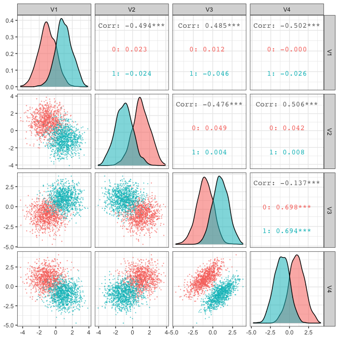
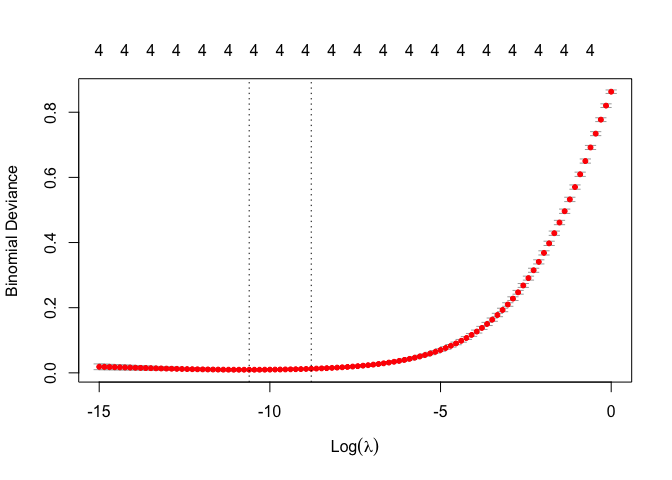

    library(tidyverse)

    ## ─ Attaching packages ──────────────────── tidyverse 1.3.0 ─

    ## ✓ ggplot2 3.3.2     ✓ purrr   0.3.4
    ## ✓ tibble  3.0.4     ✓ dplyr   1.0.2
    ## ✓ tidyr   1.1.2     ✓ stringr 1.4.0
    ## ✓ readr   1.4.0     ✓ forcats 0.5.0

    ## ─ Conflicts ───────────────────── tidyverse_conflicts() ─
    ## x dplyr::filter() masks stats::filter()
    ## x dplyr::lag()    masks stats::lag()

    set.seed(1)
    N <- 1000
    r <- 0.7
    y <- rep(c(0,1),each=N)
    V <- Matrix::bdiag(diag(2),matrix(c(1,r,r,1),2))
    X <- rbind(
      MASS::mvrnorm(N,c(-1, 1,-1, 1),V),
      MASS::mvrnorm(N,c( 1,-1, 1,-1),V)
    )

    p <- GGally::ggpairs(bind_cols(class=factor(y),as_tibble(X)),
                         columns=2:5,
                         aes(colour=class,alpha=0.5),
                         progress=FALSE,
                         lower=list(continuous=GGally::wrap("points",size=0.1,alpha=0.5))) + theme_bw()

    ## Registered S3 method overwritten by 'GGally':
    ##   method from   
    ##   +.gg   ggplot2

    ## Warning: The `x` argument of `as_tibble.matrix()` must have unique column names if `.name_repair` is omitted as of tibble 2.0.0.
    ## Using compatibility `.name_repair`.
    ## This warning is displayed once every 8 hours.
    ## Call `lifecycle::last_warnings()` to see where this warning was generated.

    print(p)

    ridge <- glmnet::cv.glmnet( # 
      X,y,family="binomial",alpha=0,
      lambda=exp(seq(-15,0,len=100))
    )
    plot(ridge) 

    alasso <- glmnet::glmnet(
      X,y,family="binomial",alpha=1,
      penalty=(1/abs(coef(ridge,"lambda.1se"))[-1]),
      lambda=exp(seq(-8,0,len=150))
    )
    b2 <- with(alasso, min(lambda[df==2])) # best lambda at df=2

    col <- 4
    path <- alasso$beta %>% as.matrix() %>% t %>% 
      as_tibble() %>% mutate(lambda=alasso$lambda) %>% 
      gather(key=Variable,value=Coefficient,-(col+1)) %>%
      ggplot(aes(x=log(lambda),y=Coefficient,color=Variable)) + 
      geom_line(size=1) + theme_minimal() + 
      ggsci::scale_color_d3("category20")
    print(path)

    w <- coef(alasso,s=b2)
    pal <- rep(c("salmon","skyblue"),each=N)
    op <- par(mfrow=c(4,4),mai=c(0.6,0.6,0.1,0.1))
    for(i in 1:4) for(j in 1:4) {
      amp <- sqrt(sum(w[c(i+1,j+1)]^2))
      plot(X[,c(i,j)],pch=16,asp=1,col=pal,cex=0.4,xlab=i,ylab=j,axes=FALSE)
      arrows(0,0,2*w[i+1]/amp,2*w[j+1]/amp,length=0.1)
      if(w[j+1]==0) {abline(v=0); next}
      abline(-w[1]/w[j+1],-w[i+1]/w[j+1])
    }

    par(op)
